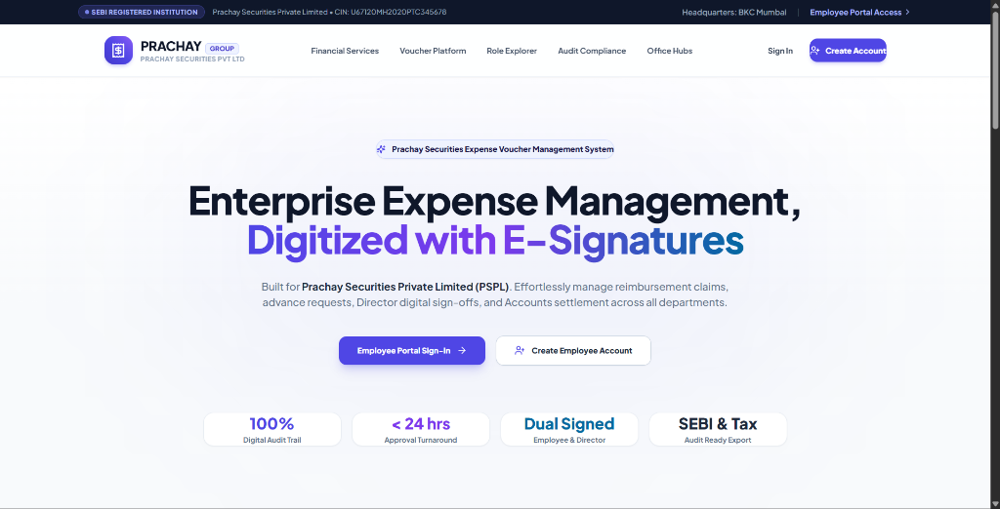
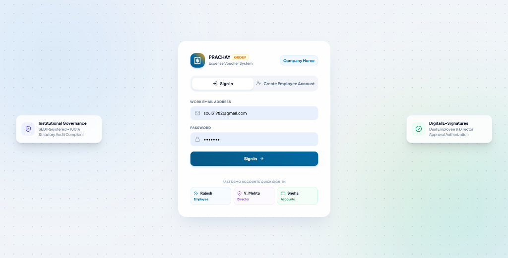
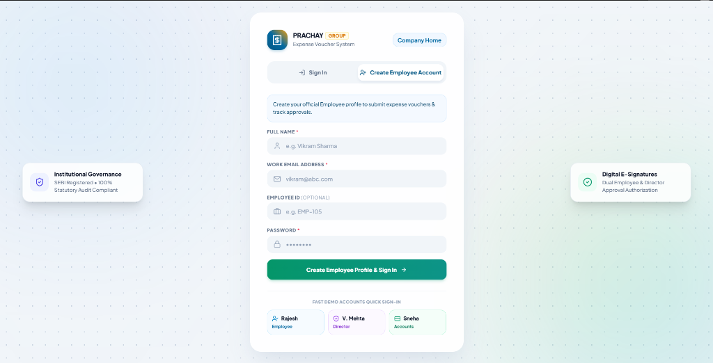
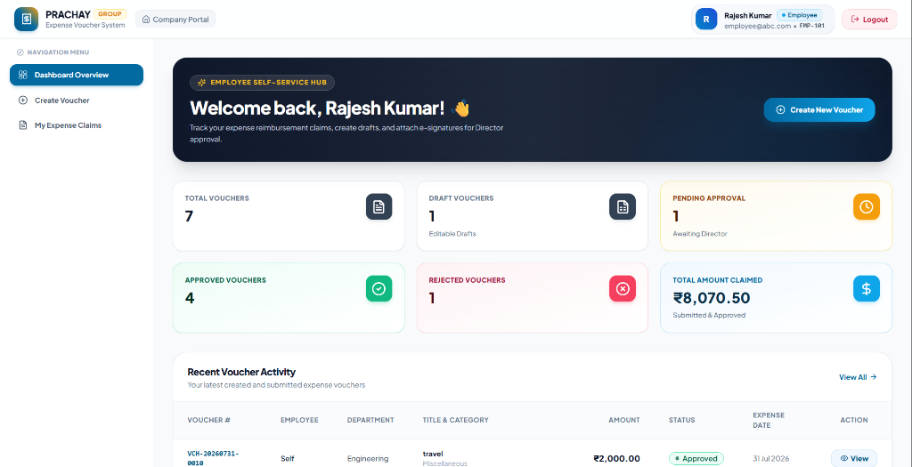
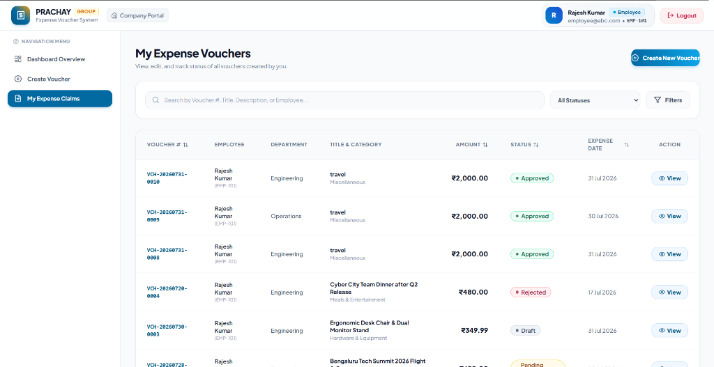
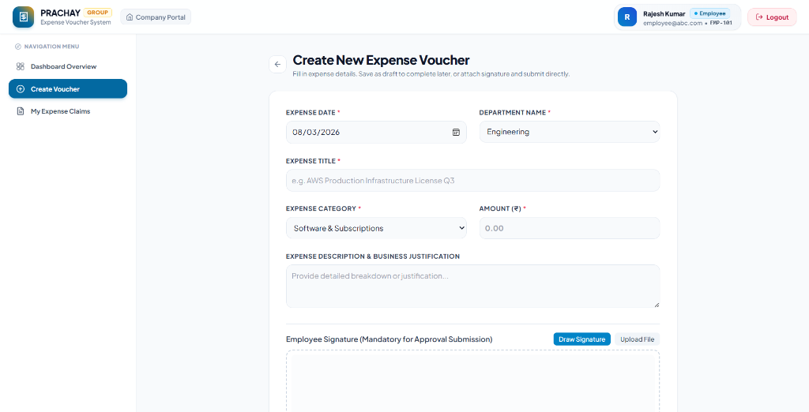
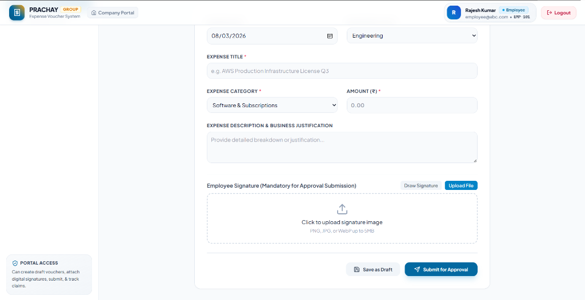
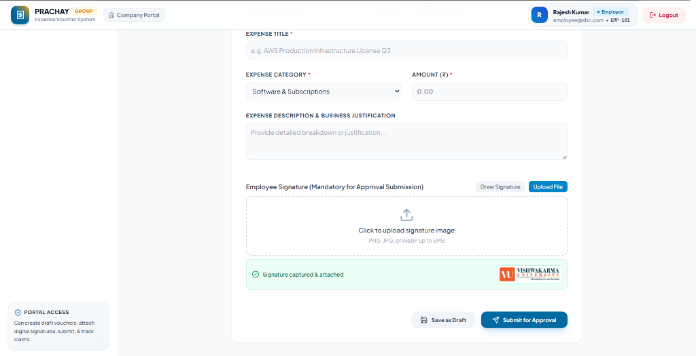
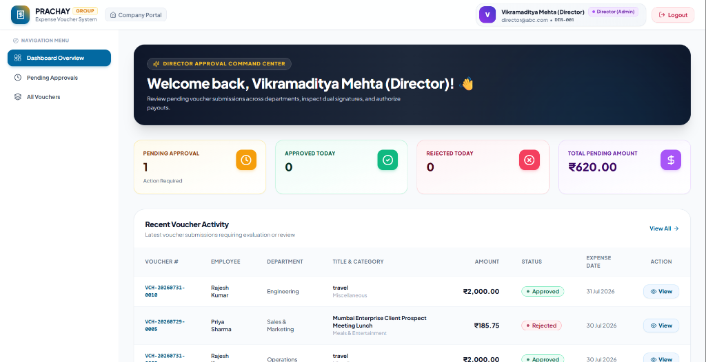
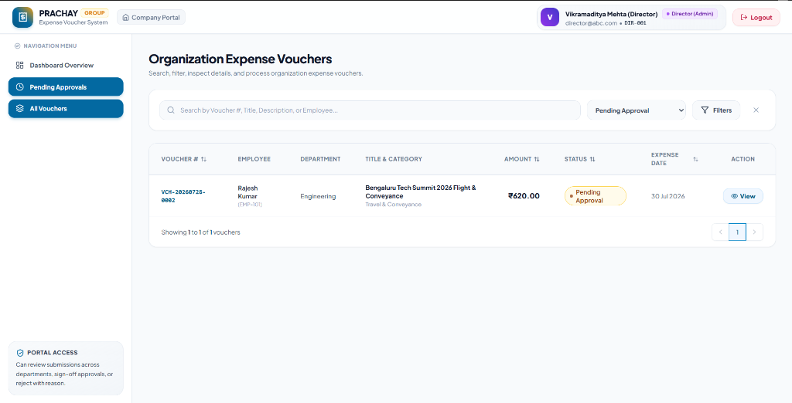

# Expense Voucher Management System

> Production-grade, full-stack digitized expense creation, approval workflow, and reimbursement tracking system built for **Prachay Securities Private Limited (PSPL)**.

---
## 📹 Full Application Walkthrough Demo Video

Watch the complete digitized expense creation, digital signature authorization, approval workflow, and CSV export demo:

<video controls src="./Demo%20Video.mp4" width="100%" poster="./docs/images/landing_page_v2.png">
  <p>Your browser does not support HTML5 video. You can <a href="./Demo%20Video.mp4">download the Demo Video.mp4 file</a> directly.</p>
</video>

---

- 🎬 **Play / Download Video**: [`./Demo Video.mp4`](./Demo%20Video.mp4) (179 MB High-Definition Walkthrough)

---

## 🖼️ Application Screenshots & UI Showcase

### 1. Prachay Securities Corporate Landing Page (`/`)


---

### 2. Tabbed Portal — Sign In Mode (`/login`)


---

### 3. Tabbed Portal — Create Employee Account Mode (`/login?tab=register`)


---

### 4. Employee Self-Service Hub & Expense Claims

#### A. Employee Dashboard Overview


#### B. My Expense Claims List View


---

### 5. Create New Expense Voucher & Signature Attachment

#### A. Voucher Creation Form


#### B. Signature Attachment — File Upload Mode


#### C. Signature Attachment — Signature Captured & Attached State


---

### 6. Director Approval Command Center & Queue

#### A. Director Approval Dashboard Hub


#### B. Pending Approvals Queue View


---

### 7. Director Approval Modal & Sign-Off Authorization

#### A. Initial Director Signature Modal


#### B. Signature Captured & Confirmed State


---

### 8. Official Expense Reimbursement Voucher Detail View (Print / PDF Ready)


---

### 9. Accounts & Reimbursement Center Dashboard


---

### 10. Organization Expense Vouchers List & Search/Filters


---

### 11. Advanced Multi-Param Search & Filtering Drawer (Department, Category, Date Range, Amount Range)


## 🚀 Executive Summary & Architecture Overview

This application digitizes the manual employee expense reimbursement process into an automated, role-governed digital workflow. It strictly enforces role-based access control (RBAC), signature authorization, audit history, and validation rules across **Employees**, **Directors (Admin)**, and the **Accounts Team**.

```
                           +------------------------+
                           |   React 18 + Vite SPA  |
                           | (TanStack Query, Zod,  |
                           |   Tailwind CSS, RTL)   |
                           +-----------+------------+
                                       |
                                REST API (JSON)
                                       v
                           +------------------------+
                           |  Node.js + Express API |
                           | (Strict TS, JWT, Helmet|
                           |  Multer, Magic-Bytes)  |
                           +-----------+------------+
                                       |
                                  Prisma ORM
                                       v
                           +------------------------+
                           |   PostgreSQL 16 DB     |
                           | (Indexes, Normalization|
                           |  CHECK & FK Constraints|
                           +------------------------+
```

### Key Architectural Choices & Recent Enhancements:
- **Corporate Landing Page**: Dedicated, creative landing page at `/` detailing Prachay Securities institution background, SEBI compliance, interactive system inspector, role gateways, and registered office hubs (BKC Mumbai, Whitefield Bengaluru, Cyber City Gurugram).
- **Self-Service Employee Registration**: Built `/auth/register` API allowing new users to self-register Employee accounts, attach Employee IDs, and immediately begin creating and submitting vouchers.
- **Tabbed Sign In & Sign Up Portal**: Dual-mode login portal at `/login` with 1-click fast demo quick sign-in cards for Employee, Director, and Accounts profiles.
- **Cohesive Corporate Design System**: Restructured design system using Tailwind CSS with unified Indigo & Violet accent tokens, glowing metric cards with status badges, and polished user profile avatar chips in the navbar.
- **Clean Layered Backend Architecture**: Routes → Controllers → Services → Prisma Data Access. Zero business logic in route handlers.
- **Strict Type Safety**: End-to-end TypeScript (strict mode enabled, zero `any`).
- **Production Security**:
  - `HttpOnly`, `Secure`, `SameSite` cookies for Refresh Token rotation.
  - Short-lived JWT access tokens in memory/headers.
  - Bcrypt password hashing (cost factor = 12).
  - Rate limiting on auth endpoints (`express-rate-limit`).
  - Strict magic-byte file validation (`PNG`/`JPEG`/`WebP`) for signature uploads.
  - Helmet security headers & CORS origin locking.
- **Database Normalization & Performance**: PostgreSQL with Prisma migrations, composite indexes on frequent query paths `(status, employeeId)`, `(department)`, `(expenseCategory)`, `(createdAt)`, and foreign key constraints.

---

## 🧭 Page Routes & Application Flow

- **Corporate Landing Page** (`http://localhost:3000/`): Institutional homepage showcasing system capabilities, SEBI compliance, and quick portal links.
- **Sign In & Employee Account Portal** (`http://localhost:3000/login`): Tabbed portal to Sign In or Create a new Employee Account. Includes quick 1-click demo sign-in buttons.
- **Protected Dashboard Hub** (`http://localhost:3000/dashboard`): Role-tailored metrics, pending approvals queue, and recent voucher activity.
- **Voucher Management List** (`http://localhost:3000/vouchers`): Searchable table with multi-parameter filtering (department, category, date range, amount range, status).
- **Create / Edit Voucher** (`http://localhost:3000/vouchers/create`): Form with HTML5 canvas drawing pad & file upload signature attachment.
- **Voucher Detail View** (`http://localhost:3000/vouchers/:id`): Print/PDF ready statutory voucher with dual Employee and Director signatures.

---

## 🛠️ Technology Stack

| Tier | Tech | Description |
| :--- | :--- | :--- |
| **Frontend** | React 18, Vite, TypeScript | Modern, high-performance SPA |
| **State & Data Fetching** | TanStack Query (v5) | Server state management & caching |
| **Form & Validation** | React Hook Form, Zod | Type-safe form handling & input validation |
| **Styling** | Tailwind CSS v3, Lucide Icons | Responsive modern design system with Indigo & Violet palette |
| **Backend** | Node.js, Express, TypeScript | RESTful API server |
| **Database & ORM** | PostgreSQL 16 / SQLite, Prisma ORM | Relational database with migration engine |
| **Auth & Security** | JWT, HttpOnly Cookies, Bcrypt, Helmet | Secure session and identity management |
| **API Spec** | Swagger UI, OpenAPI 3.0 | Interactive API documentation |
| **Testing** | Jest, Supertest, Vitest | Integration & unit test suites |
| **DevOps** | Docker, Docker Compose, GitHub Actions | Containerization & CI/CD pipeline |

---

## 🔑 Pre-Configured Seed Demo Credentials

For instant evaluation across all three user roles, run the seed script or spin up Docker. The system comes pre-loaded with test accounts, or you can register a new Employee account directly on the Sign Up tab:

| Role | Email | Password | Employee ID | Capabilities |
| :--- | :--- | :--- | :--- | :--- |
| **Employee** | `employee@abc.com` | `Employee@123` | `EMP-101` | Create, edit draft, upload/draw signature, submit, track own vouchers |
| **Employee 2** | `jane.doe@abc.com` | `Password@123` | `EMP-102` | Secondary employee account |
| **Director (Admin)** | `director@abc.com` | `Director@123` | `DIR-001` | View all org vouchers, filter pending, approve with signature, reject with remarks |
| **Accounts Team** | `accounts@abc.com` | `Accounts@123` | `ACC-001` | Monitor all vouchers, search & filter, view signatures, print/download reimbursement vouchers |

---

## ⚡ Quick Start: Running with Docker Compose (Recommended)

Spins up PostgreSQL, Backend API, and Frontend SPA with **one command**:

```bash
# Clone repository and navigate to root
cd expense-voucher-management-system

# Build and launch all services in detached mode
docker compose up --build -d
```

### Access URLs:
- **Corporate Landing Page**: [http://localhost:3000](http://localhost:3000)
- **Sign In & Register Portal**: [http://localhost:3000/login](http://localhost:3000/login)
- **Backend API**: [http://localhost:5000/api/v1](http://localhost:5000/api/v1)
- **Interactive Swagger Docs**: [http://localhost:5000/api/docs](http://localhost:5000/api/docs)
- **Health Check Endpoint**: [http://localhost:5000/api/v1/health](http://localhost:5000/api/v1/health)

---

## 💻 Manual Setup Instructions (Fallback)

### Prerequisites:
- **Node.js**: `v20.x` or higher
- **PostgreSQL / SQLite**: Database engine

### 1. Backend Setup
```bash
cd backend

# Install dependencies
npm install

# Copy environment file
cp ../.env.example .env

# Generate Prisma client & run database migrations
npx prisma generate
npx prisma migrate dev --name init

# Seed database with demo accounts & sample vouchers
npm run db:seed

# Start backend development server (Port 5000)
npm run dev
```

### 2. Frontend Setup
```bash
cd ../frontend

# Install dependencies
npm install

# Start Vite frontend development server (Port 3000)
npm run dev
```

---

## 🗄️ Database Schema & ERD Breakdown

### Tables & Relationships:

#### 1. `users`
- `id` (UUID, Primary Key)
- `email` (VarChar, Unique, Indexed)
- `passwordHash` (Text, Bcrypt Hash)
- `name` (VarChar)
- `employeeId` (VarChar, Unique, e.g., `EMP-101`)
- `role` (Enum: `EMPLOYEE`, `DIRECTOR`, `ACCOUNTS`)
- `createdAt`, `updatedAt` (Timestamp)

#### 2. `vouchers`
- `id` (UUID, Primary Key)
- `voucherNumber` (VarChar, Unique, Indexed, e.g., `VCH-20260731-0001`)
- `voucherDate` (Timestamp)
- `expenseDate` (Timestamp)
- `department` (VarChar, Indexed)
- `expenseTitle` (VarChar)
- `expenseCategory` (VarChar, Indexed)
- `expenseDescription` (Text)
- `amount` (Decimal(12,2), CHECK > 0, Indexed)
- `status` (Enum: `DRAFT`, `PENDING_APPROVAL`, `APPROVED`, `REJECTED`, Indexed)
- `employeeId` (UUID, Foreign Key -> `users.id`)
- `employeeSignatureUrl` (Text, Nullable)
- `directorId` (UUID, Foreign Key -> `users.id`, Nullable)
- `directorSignatureUrl` (Text, Nullable)
- `approvalDate` (Timestamp, Nullable)
- `rejectionReason` (Text, Nullable)
- `createdAt`, `updatedAt` (Timestamp, Indexed)

#### 3. `refresh_tokens`
- `id` (UUID, Primary Key)
- `token` (VarChar, Unique)
- `userId` (UUID, Foreign Key -> `users.id` ON DELETE CASCADE)
- `expiresAt`, `revokedAt`, `createdAt` (Timestamp)

---

## 🌐 API Endpoint Summary

All routes are versioned under `/api/v1` and documented via OpenAPI/Swagger at `/api/docs`.

### Auth Endpoints (`/api/v1/auth`)
- `POST /register`: Registers a new Employee profile (`name`, `email`, `password`, `employeeId`).
- `POST /login`: Authenticates user, issues JWT access token + HttpOnly refresh cookie.
- `POST /refresh`: Rotates refresh token, returns new access token.
- `POST /logout`: Revokes refresh token and clears cookie.
- `GET /me`: Returns active user profile.

### Voucher Endpoints (`/api/v1/vouchers`)
- `GET /`: List vouchers with search (`q`), filter (`status`, `department`, `expenseCategory`, `startDate`, `endDate`, `minAmount`, `maxAmount`), pagination (`page`, `limit`), and sorting (`sortBy`, `sortOrder`).
- `POST /`: Create new voucher (`saveAsDraft: true` or submit directly).
- `GET /:id`: Retrieve full voucher details.
- `PUT /:id`: Update draft voucher (Owner Employee only, status must be `DRAFT`).
- `DELETE /:id`: Delete draft voucher (Owner Employee only, status must be `DRAFT`).
- `POST /:id/submit`: Submit draft voucher for approval (Requires `employeeSignatureUrl`).
- `POST /:id/approve`: Director approves voucher (Requires `directorSignatureUrl`).
- `POST /:id/reject`: Director rejects voucher (Requires `rejectionReason`).

### Dashboard & Upload Endpoints
- `GET /api/v1/dashboard/metrics`: Role-tailored metrics & recent activity feeds.
- `POST /api/v1/uploads/signature`: Uploads signature image file with magic-byte verification.
- `POST /api/v1/uploads/signature-base64`: Uploads canvas drawing signature data URL.

---

## 🧪 Testing Suite & Coverage Verification

```bash
# Run backend integration tests
cd backend
npm test

# Run frontend tests
cd frontend
npm test
```

The test suites cover:
- JWT authentication, employee registration, & refresh cookie rotation.
- Role-based authorization edge cases (e.g. Director cannot create vouchers; Employee cannot approve).
- Voucher state machine transitions (Draft → Pending Approval → Approved / Rejected).
- Validation rules (negative amounts, missing signatures, missing rejection reasons).

---

## 📌 Documented Assumptions

1. **Signature Capture Flexibility**: Both interactive HTML5 Canvas drawing and standard PNG/JPEG file upload are supported to provide optimal UX.
2. **Employee Registration**: Self-service registration creates accounts strictly with `EMPLOYEE` role to maintain security boundaries. Director and Accounts profiles are managed via seeding or administrative configuration.
3. **Voucher Numbering**: Generated sequentially per day in format `VCH-YYYYMMDD-XXXX`.

---

## 🚢 Deployment Guide (Render / Railway / AWS)

### Deploying to Render:
1. **Database**: Create a Managed PostgreSQL Instance on Render.
2. **Backend Web Service**:
   - Environment: Node.js
   - Build Command: `cd backend && npm install && npx prisma generate && npm run build`
   - Start Command: `cd backend && npx prisma migrate deploy && node dist/server.js`
   - Set Environment Variables (`DATABASE_URL`, `JWT_SECRET`, `JWT_REFRESH_SECRET`, `CLIENT_URL`).
3. **Frontend Static Site**:
   - Build Command: `cd frontend && npm install && npm run build`
   - Publish Directory: `frontend/dist`
   - Rewrite All URLs to `/index.html`.

---

## 🔮 Roadmap / Future V2 Enhancements

- Multi-currency support with automatic exchange rate conversion.
- Direct integration with S3 cloud object storage for signature assets.
- Email / Slack notification webhooks upon voucher submission, approval, or rejection.
- Bulk approval actions for Directors.
