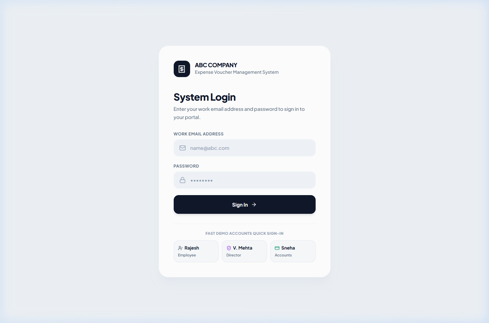
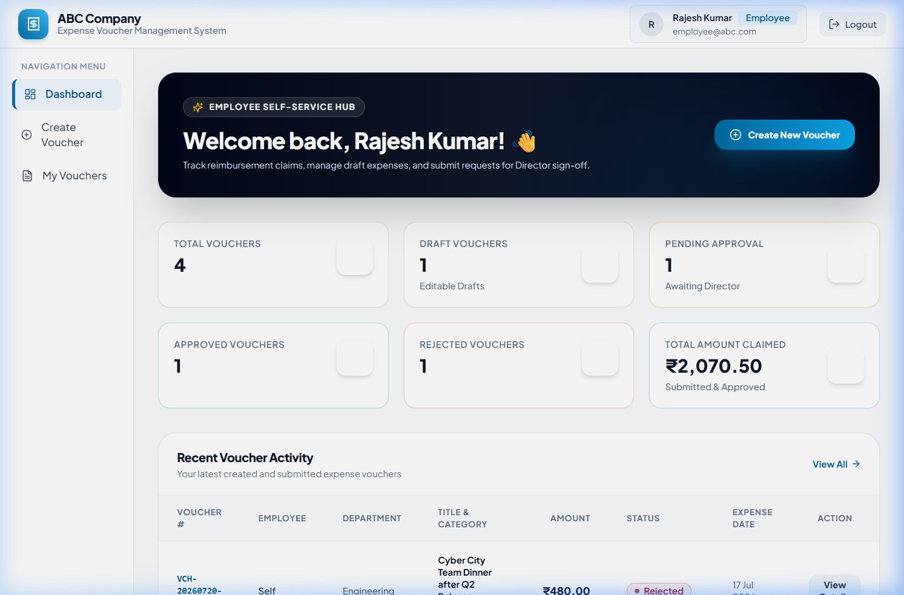
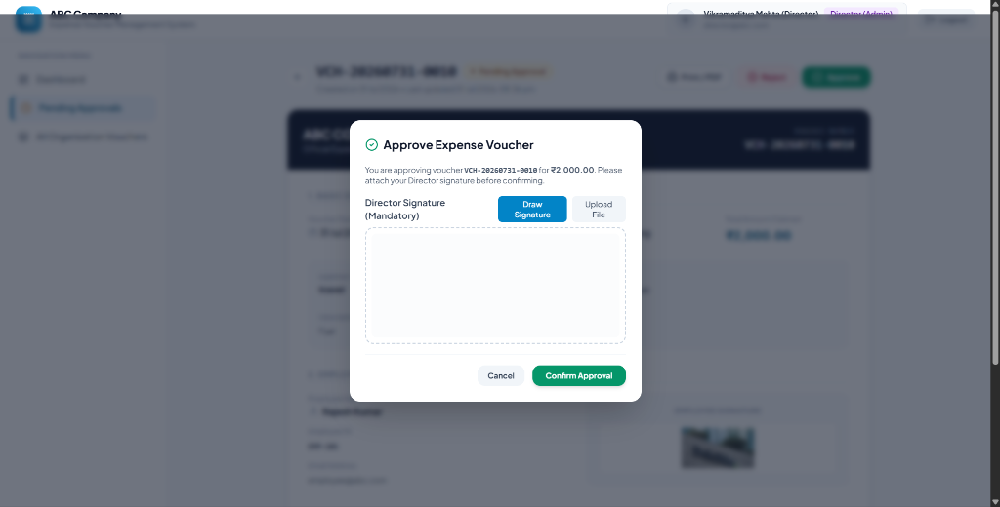
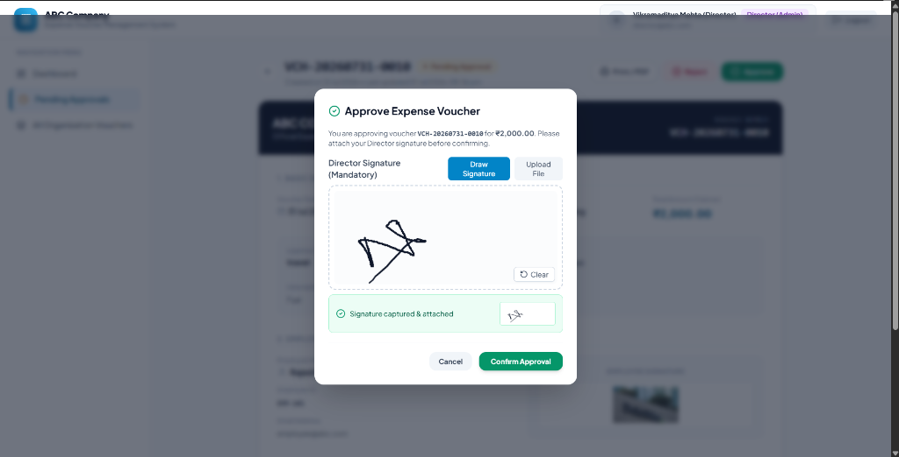
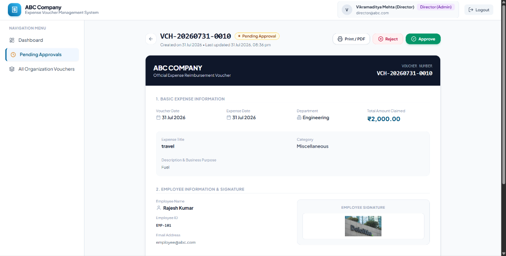
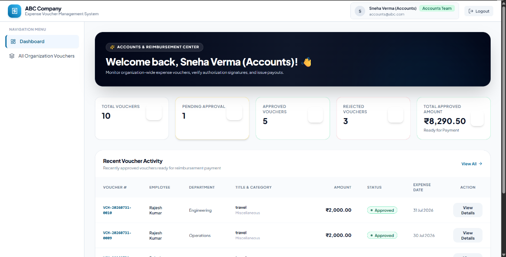
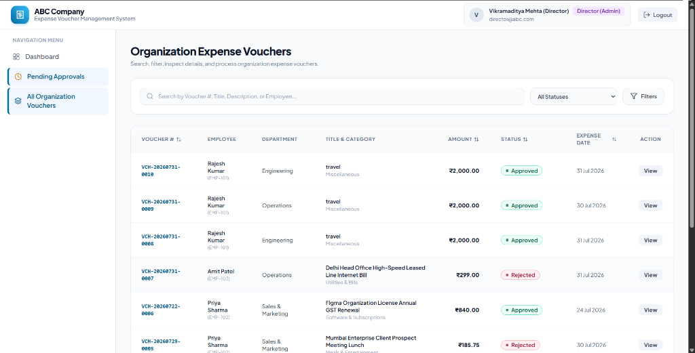
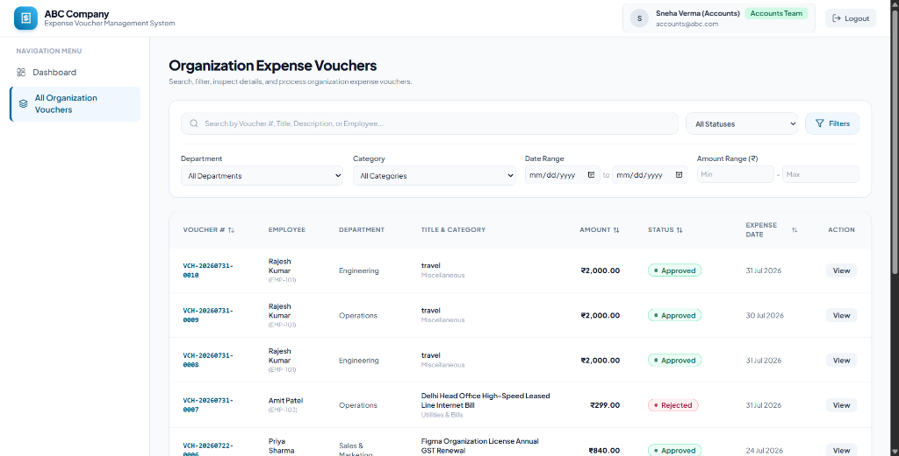

# Expense Voucher Management System

> Production-grade, full-stack digitized expense creation, approval workflow, and reimbursement tracking system built for **ABC Company / Prachay Securities Private Limited**.

---

## 🖼️ Application Screenshots & UI Showcase

### 1. System Login Portal


---

### 4. Director Approval Command Center & Dashboard


---

### 5. Director Approval Modal & Sign-Off Authorization

#### A. Initial Director Signature Modal


#### B. Signature Captured & Confirmed State


---

### 6. Official Expense Reimbursement Voucher Detail View (Print / PDF Ready)


---

### 7. Accounts & Reimbursement Center Dashboard


---

### 8. Organization Expense Vouchers List & Search/Filters


---

### 9. Advanced Multi-Param Search & Filtering Drawer (Department, Category, Date Range, Amount Range)


---

## 📹 Full Application Walkthrough Demo Video

Watch the complete digitized expense creation, digital signature authorization, approval workflow, and CSV export demo:

- 🎬 **Video File**: [`./WORKING OF APP.mp4`](./WORKING%20OF%20APP.mp4)

---

https://github.com/user-attachments/assets/27f452ba-4125-4b49-a7ac-1aee65037dc4


https://github.com/user-attachments/assets/f79eab2c-d736-415c-a7af-d2e8ebd11401


## 🚀 Executive Summary & Architecture Overview

This application digitizes the manual employee expense reimbursement process into an automated, role-governed digital workflow. It strictly enforces role-based access control (RBAC), signature authorization, audit history, and validation rules across **Employees**, **Directors (Admin)**, and the **Accounts Team**.

```
                           +------------------------+
                           |   React 18 + Vite SPA  |
                           | (TanStack Query, Zod,  |
                           |   Tailwind CSS, RTL)   |
                           +-----------+------------+
                                       |
                                REST API (JSON)
                                       v
                           +------------------------+
                           |  Node.js + Express API |
                           | (Strict TS, JWT, Helmet|
                           |  Multer, Magic-Bytes)  |
                           +-----------+------------+
                                       |
                                  Prisma ORM
                                       v
                           +------------------------+
                           |   PostgreSQL 16 DB     |
                           | (Indexes, Normalization|
                           |  CHECK & FK Constraints|
                           +------------------------+
```

### Key Architectural Choices:
- **Clean Layered Backend Architecture**: Routes → Controllers → Services → Prisma Data Access. Zero business logic in route handlers.
- **Frontend Separation of Concerns**: Centralized API layer (`axios` interceptors with JWT refresh rotation), custom TanStack Query hooks, presentational components, and role-protected routes.
- **Strict Type Safety**: End-to-end TypeScript (strict mode enabled, zero `any`).
- **Production Security**:
  - `HttpOnly`, `Secure`, `SameSite` cookies for Refresh Token rotation.
  - Short-lived JWT access tokens in memory/headers.
  - Bcrypt password hashing (cost factor = 12).
  - Rate limiting on auth endpoints (`express-rate-limit`).
  - Strict magic-byte file validation (`PNG`/`JPEG`/`WebP`) for signature uploads.
  - Helmet security headers & CORS origin locking.
- **Database Normalization & Performance**: PostgreSQL with Prisma migrations, composite indexes on frequent query paths `(status, employeeId)`, `(department)`, `(expenseCategory)`, `(createdAt)`, and foreign key constraints.

---


## 🛠️ Technology Stack

| Tier | Tech | Description |
| :--- | :--- | :--- |
| **Frontend** | React 18, Vite, TypeScript | Modern, high-performance SPA |
| **State & Data Fetching** | TanStack Query (v5) | Server state management & caching |
| **Form & Validation** | React Hook Form, Zod | Type-safe form handling & input validation |
| **Styling** | Tailwind CSS v3, Lucide Icons | Responsive modern design system |
| **Backend** | Node.js, Express, TypeScript | RESTful API server |
| **Database & ORM** | PostgreSQL 16, Prisma ORM | Relational database with migration engine |
| **Auth & Security** | JWT, HttpOnly Cookies, Bcrypt, Helmet | Secure session and identity management |
| **API Spec** | Swagger UI, OpenAPI 3.0 | Interactive API documentation |
| **Testing** | Jest, Supertest, Vitest | Integration & unit test suites |
| **DevOps** | Docker, Docker Compose, GitHub Actions | Containerization & CI/CD pipeline |

---

## 🔑 Pre-Configured Seed Demo Credentials

For instant evaluation across all three user roles, run the seed script or spin up Docker. The system comes pre-loaded with the following test accounts:

| Role | Email | Password | Employee ID | Capabilities |
| :--- | :--- | :--- | :--- | :--- |
| **Employee** | `employee@abc.com` | `Employee@123` | `EMP-001` | Create, edit draft, upload signature, submit, track own vouchers |
| **Employee 2** | `jane.doe@abc.com` | `Password@123` | `EMP-002` | Secondary employee account |
| **Director (Admin)** | `director@abc.com` | `Director@123` | `DIR-001` | View all org vouchers, filter pending, approve with signature, reject with remarks |
| **Accounts Team** | `accounts@abc.com` | `Accounts@123` | `ACC-001` | Monitor all vouchers, search & filter, view signatures, print/download reimbursement vouchers |

---

## ⚡ Quick Start: Running with Docker Compose (Recommended)

Spins up PostgreSQL, Backend API, and Frontend SPA with **one command**:

```bash
# Clone repository and navigate to root
cd expense-voucher-management-system

# Build and launch all services in detached mode
docker compose up --build -d
```

### Access URLs:
- **Frontend SPA**: [http://localhost:3000](http://localhost:3000)
- **Backend API**: [http://localhost:5000/api/v1](http://localhost:5000/api/v1)
- **Interactive Swagger Docs**: [http://localhost:5000/api/docs](http://localhost:5000/api/docs)
- **Health Check Endpoint**: [http://localhost:5000/api/v1/health](http://localhost:5000/api/v1/health)

---

## 💻 Manual Setup Instructions (Fallback)

### Prerequisites:
- **Node.js**: `v20.x` or higher
- **PostgreSQL**: Running locally on port `5432`

### 1. Backend Setup
```bash
cd backend

# Install dependencies
npm install

# Copy environment file
cp ../.env.example .env

# Generate Prisma client & run database migrations
npx prisma generate
npx prisma migrate dev --name init

# Seed database with demo accounts & sample vouchers
npm run db:seed

# Start backend development server (Port 5000)
npm run dev
```

### 2. Frontend Setup
```bash
cd ../frontend

# Install dependencies
npm install

# Start Vite frontend development server (Port 3000)
npm run dev
```

---

## 🗄️ Database Schema & ERD Breakdown

### Tables & Relationships:

#### 1. `users`
- `id` (UUID, Primary Key)
- `email` (VarChar, Unique, Indexed)
- `passwordHash` (Text, Bcrypt Hash)
- `name` (VarChar)
- `employeeId` (VarChar, Unique, e.g., `EMP-001`)
- `role` (Enum: `EMPLOYEE`, `DIRECTOR`, `ACCOUNTS`)
- `createdAt`, `updatedAt` (Timestamp)

#### 2. `vouchers`
- `id` (UUID, Primary Key)
- `voucherNumber` (VarChar, Unique, Indexed, e.g., `VCH-20260731-0001`)
- `voucherDate` (Timestamp)
- `expenseDate` (Timestamp)
- `department` (VarChar, Indexed)
- `expenseTitle` (VarChar)
- `expenseCategory` (VarChar, Indexed)
- `expenseDescription` (Text)
- `amount` (Decimal(12,2), CHECK > 0, Indexed)
- `status` (Enum: `DRAFT`, `PENDING_APPROVAL`, `APPROVED`, `REJECTED`, Indexed)
- `employeeId` (UUID, Foreign Key -> `users.id`)
- `employeeSignatureUrl` (Text, Nullable)
- `directorId` (UUID, Foreign Key -> `users.id`, Nullable)
- `directorSignatureUrl` (Text, Nullable)
- `approvalDate` (Timestamp, Nullable)
- `rejectionReason` (Text, Nullable)
- `createdAt`, `updatedAt` (Timestamp, Indexed)

#### 3. `refresh_tokens`
- `id` (UUID, Primary Key)
- `token` (VarChar, Unique)
- `userId` (UUID, Foreign Key -> `users.id` ON DELETE CASCADE)
- `expiresAt`, `revokedAt`, `createdAt` (Timestamp)

---

## 🌐 API Endpoint Summary

All routes are versioned under `/api/v1` and documented via OpenAPI/Swagger at `/api/docs`.

### Auth Endpoints (`/api/v1/auth`)
- `POST /login`: Authenticates user, issues JWT access token + HttpOnly refresh cookie.
- `POST /refresh`: Rotates refresh token, returns new access token.
- `POST /logout`: Revokes refresh token and clears cookie.
- `GET /me`: Returns active user profile.

### Voucher Endpoints (`/api/v1/vouchers`)
- `GET /`: List vouchers with search (`q`), filter (`status`, `department`, `expenseCategory`, `startDate`, `endDate`, `minAmount`, `maxAmount`), pagination (`page`, `limit`), and sorting (`sortBy`, `sortOrder`).
- `POST /`: Create new voucher (`saveAsDraft: true` or submit directly).
- `GET /:id`: Retrieve full voucher details.
- `PUT /:id`: Update draft voucher (Owner Employee only, status must be `DRAFT`).
- `DELETE /:id`: Delete draft voucher (Owner Employee only, status must be `DRAFT`).
- `POST /:id/submit`: Submit draft voucher for approval (Requires `employeeSignatureUrl`).
- `POST /:id/approve`: Director approves voucher (Requires `directorSignatureUrl`).
- `POST /:id/reject`: Director rejects voucher (Requires `rejectionReason`).

### Dashboard & Upload Endpoints
- `GET /api/v1/dashboard/metrics`: Role-tailored metrics & recent activity feeds.
- `POST /api/v1/uploads/signature`: Uploads signature image file with magic-byte verification.
- `POST /api/v1/uploads/signature-base64`: Uploads canvas drawing signature data URL.

---

## 🧪 Testing Suite & Coverage Verification

```bash
# Run backend integration tests
cd backend
npm test

# Run frontend tests
cd frontend
npm test
```

The backend test suite covers:
- JWT authentication & refresh cookie rotation.
- Role-based authorization edge cases (e.g. Director cannot create vouchers; Employee cannot approve).
- Voucher state machine transitions (Draft → Pending Approval → Approved / Rejected).
- Validation rules (negative amounts, missing signatures, missing rejection reasons).

---

## 📄 Explicit Requirements Traceability Matrix

Every single functional, validation, role restriction, dashboard metric, and field requirement listed in `Full_Stack_Developer_Internship_Assignment_PSPL.docx` is strictly implemented and verified:

| Requirement Category | Requirement Specification | Verification / Implementation |
| :--- | :--- | :--- |
| **User Roles** | Employee, Director (Admin), Accounts Team | Enforced in database enum `Role` & backend middleware `requireRole(...)` |
| **Employee Limits** | Cannot view others' vouchers, cannot approve/reject, cannot edit non-drafts | Scoped queries `where: { employeeId: user.userId }` & state checks in `voucher.service.ts` |
| **Director Limits** | Cannot modify employee-entered voucher details | Director endpoints only update `status`, `directorSignatureUrl`, `approvalDate`, `rejectionReason` |
| **Accounts Limits** | Cannot create, edit, delete, approve, or reject vouchers | Middleware returns 403 Forbidden for Accounts on mutation endpoints |
| **Workflow State** | `DRAFT` → `SUBMITTED/PENDING_APPROVAL` → `APPROVED` / `REJECTED` | Enforced state transitions in `voucher.service.ts` |
| **Validation Rules** | Department, Title, Expense Date, Amount (> 0) mandatory | Zod schemas on backend (`voucher.schema.ts`) & frontend (`React Hook Form`) |
| **Signature Rules** | Employee signature required on submit; Director signature required on approve | Strict validation in `submitVoucher` and `approveVoucher` service methods |
| **Rejection Rule** | Rejection reason mandatory when rejecting | Validated in `rejectVoucher` service method; displayed in detail view & alert |
| **Auto Voucher #** | Auto-generated unique voucher number | Formatted as `VCH-YYYYMMDD-0001` using database counters |
| **Search & Filter** | Search by Voucher #, Employee, Department, Category, Status, Date Range, Amount Range | Full query builder in `voucher.service.ts` & advanced search bar in `VoucherListPage.tsx` |
| **Employee Dash** | Total, Draft, Pending, Approved, Rejected, Total Amount Claimed | Aggregated in `dashboard.service.ts` & rendered in `DashboardPage.tsx` |
| **Director Dash** | Pending Count, Approved Today, Rejected Today, Pending Amount, Recent Activity | Real-time queries in `dashboard.service.ts` & rendered in `DashboardPage.tsx` |
| **Accounts Dash** | Total, Pending, Approved, Rejected, Total Approved Amount, Recent Approved | Aggregated in `dashboard.service.ts` & rendered in `DashboardPage.tsx` |

---

## 📌 Documented Assumptions

1. **Signature Capture Flexibility**: Both interactive HTML5 Canvas drawing and standard PNG/JPEG file upload are supported to provide optimal UX.
2. **Reimbursement Processing**: Accounts team marks vouchers for reimbursement by viewing approved vouchers and printing/exporting official voucher PDFs.
3. **Voucher Numbering**: Generated sequentially per day in format `VCH-YYYYMMDD-XXXX`.

---

## 🚢 Deployment Guide (Render / Railway / AWS)

### Deploying to Render:
1. **Database**: Create a Managed PostgreSQL Instance on Render.
2. **Backend Web Service**:
   - Environment: Node.js
   - Build Command: `cd backend && npm install && npx prisma generate && npm run build`
   - Start Command: `cd backend && npx prisma migrate deploy && node dist/server.js`
   - Set Environment Variables (`DATABASE_URL`, `JWT_SECRET`, `JWT_REFRESH_SECRET`, `CLIENT_URL`).
3. **Frontend Static Site**:
   - Build Command: `cd frontend && npm install && npm run build`
   - Publish Directory: `frontend/dist`
   - Rewrite All URLs to `/index.html`.

---

## 🔮 Roadmap / Future V2 Enhancements

- Multi-currency support with automatic exchange rate conversion.
- Direct integration with S3 cloud object storage for signature assets.
- Email / Slack notification webhooks upon voucher submission, approval, or rejection.
- Bulk approval actions for Directors.
